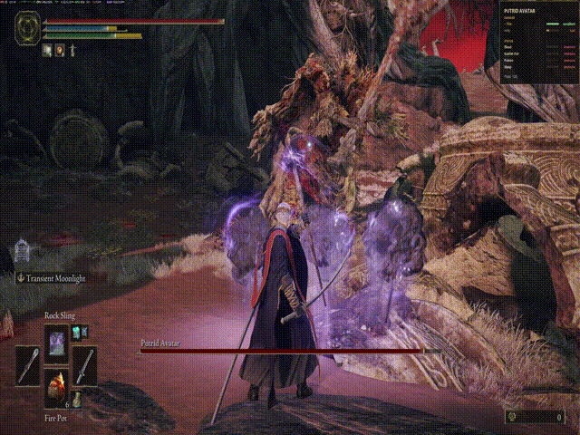

# ERDLE

**E**lden **R**ing **D**amage **L**ookup **E**ngine.

An on-screen boss cheat sheet for Elden Ring. It notices when a fight
starts, reads the boss's name off the screen, and shows what actually
works on that boss - what to bring, what not to bother with, and the
poise threshold.

**Works on any Windows PC. No special hardware, no Python, no install.**
Download the exe, double-click, play.



## Also: SteelSeries keyboards with an OLED

If you own a SteelSeries keyboard with a built-in screen - Apex Pro,
Apex Pro TKL, Apex 7, Apex 7 TKL - ERDLE drives that too, so the cheat
sheet sits below your hands instead of on top of the game. It needs
SteelSeries GG running, and it is the only hardware ERDLE supports.
Everyone else gets the overlay, which is the same information.

```
  idle              a fight              you won            you didn't
┌──────────┐    ┌──────────────┐    ┌──────────────┐    ┌──────────────┐
│  ERDLE   │ →  │TREE SENTINEL │ →  │   GOOD JOB   │ or │   GIT GUD    │
│          │    │  BLD+ FRS+   │    │  TARNISHED   │    │  TARNISHED   │
│          │    │ -HOLY P60    │    │              │    │              │
│          │    │ ████░░░ 62%  │    │              │    │              │
└──────────┘    └──────────────┘    └──────────────┘    └──────────────┘
```

`+` bring this · `-` don't bother · `x` does nothing · `P` poise threshold

Without GG, the tray reads "Overlay only" and nothing else changes.

Nothing is counted or saved. The message is the payoff, and then it goes
back to idle.

## It never touches the game

Every input comes from the framebuffer or from files:

| Channel | Used for |
|---|---|
| Desktop capture (`mss`) | Boss bar, name plate, YOU DIED / FELLED |
| Local JSON | Weakness data |
| GG's local HTTP server | Driving the OLED, if you have one |

No handle is opened to `eldenring.exe`. No DLL is injected. Nothing is
hooked, and no debugger is attached. That's the full list of things EAC
looks for, and this project does none of them - same category as OBS
capturing your gameplay.

## Install

**Just want to use it:** download `ERDLE.exe` from Releases and double-click
it. It sits in the system tray - no terminal, no Python, nothing to
install. Right-click for status, recalibrate, start-with-Windows, and the
log.

Nothing else is required. SteelSeries GG is only needed to drive a
keyboard OLED; without it the tray reads "Overlay only" and everything
else behaves identically.

Tesseract is bundled inside the exe. It used to be an optional extra, on
the grounds that the app degraded gracefully without it - true under the
old bar-driven detector, and false since detection became name-driven.
With no reader there is no name, and with no name there is no fight: the
app does nothing at all. A dependency that decides whether the program
works is not optional, so it ships inside. Costs about 30 MB.

If a build ever *does* start without one, the tray icon turns red and the
menu says "Cannot read boss names" rather than sitting there looking
healthy.

Windows will show a SmartScreen warning the first time: the exe is
unsigned, because a certificate costs more per year than this project
costs to make. **More info → Run anyway.**

It calibrates itself to your monitor on first run.

### The tray icon

The colour tells you the state, so a glance answers "is this working"
without opening the menu:

| Colour | State | Bundled as |
|---|---|---|
| Gold | watching for fights | `assets/tray-active.png` |
| Pale | starting, or stopped | `assets/tray-idle.png` |
| Blue | hunting for the boss bar | `assets/tray-calibrating.png` |
| Orange | running, but GG is not there | `assets/tray-amber.png` |
| Red | stopped, something broke | `assets/tray-error.png` |

To use your own, drop square PNGs in `%APPDATA%\erdle\` named
`icon-active.png`, `icon-idle.png`, `icon-calibrating.png`,
`icon-amber.png` or `icon-error.png`, then restart. A plain `icon.png`
covers every state at once.

No rebuild needed. A missing state borrows a neighbour's mark, and an
unreadable file falls through to the bundled art -- you can supply one
file or all five.

The icon Windows shows on `ERDLE.exe` itself *is* baked in at build time,
generated from `assets/tray-active.png` by `build.ps1`. Note that Explorer
caches icons aggressively: a rebuilt exe often keeps showing the old one
until the cache is cleared with `ie4uinit.exe -show`. To use different
art:

```bash
python tools/make_icon.py my_art.png
.\build.ps1
```

## Setup (from source)

```bash
pip install -r requirements.txt
winget install UB-Mannheim.TesseractOCR   # name recognition
python tools/vendor_tesseract.py          # copy it into vendor/ for builds
```

`build.ps1` runs the vendoring step itself; it is listed here because
running from source uses `vendor/` too if it is present.

Run Elden Ring in **borderless windowed** - exclusive fullscreen can defeat
desktop capture on some driver stacks.

```bash
python run.py              # normal operation
python run.py --dry-run    # detect and print, don't drive the OLED
python run.py --no-ocr     # health mirror only, no name recognition
python preview.py          # render every boss screen to the terminal
python smoketest.py        # prove the OLED works, no game needed
python diagnose.py         # find out why a name isn't resolving
```

## Calibrate first

This is the one step you can't skip. The pixel regions in `geometry.py`
and the colour cutoffs in `detect.BarThresholds` are **starting values
measured from footage, not from your machine**. Everything else in the
project is covered by tests; these numbers are not, because verifying them
needs a real Elden Ring frame.

Stand in front of a boss with the bar visible and run:

```bash
python -m erdle.calibrate
```

It reports what the detector sees and names the specific constant to
change when something looks wrong.

## Screen overlay

There is a second display: a borderless, always-on-top panel that appears
when a boss is identified and disappears when the fight ends. It exists
for two groups - people without a SteelSeries keyboard, who otherwise get
nothing, and people with one, who would rather not look down mid-fight.

It is not a copy of the keyboard panel, and not a data dump either. 128x40
monochrome pixels force `render.py` to throw most of the database away:
eight damage types become a best and a worst, six statuses become four
abbreviations. The overlay has room for more - but rendering all fourteen
rows turned out to answer a question nobody asked, since most of them say
the same unremarkable thing.

So it shows the middle ground: the full boss name, a one-line summary, the
damage types worth bringing, the one worth avoiding, any status that is
not ordinary, and poise. Around four rows, each with a bar showing how
good it actually is on a six-point scale the OLED cannot express.

Position it before you need it:

```bash
python overlay_demo.py            # shows a sample panel for 30 seconds
python overlay_demo.py malenia    # a specific boss
```

Drag it wherever you want. The position is saved **as a fraction of the
screen**, not as pixels, so it means the same thing on 4K, 1440p, 1080p or
a laptop -- the same reasoning behind `FractionalRect` for the HUD
regions. The horizontal fraction is measured against the free space rather
than the screen width, so 1.0 is flush right everywhere and the panel can
never hang off the edge.

You can also set it without dragging:

```bash
python overlay_demo.py --at 1,0.05        # top-right
python overlay_demo.py --at 0,0.05        # top-left
python overlay_demo.py --reset-position   # back to the default
```

Toggle the whole thing from the tray menu, or run `python run.py
--no-overlay`.

### Checking it without a boss fight

```bash
python run.py --overlay-test margit                      # draw one boss, 20s
python run.py --overlay-test rykard --overlay-detail full
python run.py --overlay-test "godskin duo" --overlay-detail compact
```

The name is matched as a substring, so `rykard` finds "Rykard, Lord of
Blasphemy". Drag the panel while it is up and the position saves on
release.

This is the first thing to try when the overlay does not appear, because
it separates the two causes that look identical from the outside: the
window never opened, or it opened and detection never named a boss. If
the window is the problem, `run.py` now says which of the four ways it
failed rather than printing a bare `overlay: off`.

Two views. **Compact** is the default: the damage types worth bringing,
the one worth avoiding, any status that is not ordinary, and poise --
typically four rows. **Full** lists all eight damage types and all six
statuses. Switch with "Overlay: full detail" in the tray menu -- it takes
effect immediately, no restart -- or preview it with
`python overlay_demo.py --full`.

### Tweaking the layout

Spacing lives in one block at the top of `erdle/overlay_ui.py`, all in
pixels at 96 DPI:

| Constant | Controls |
|---|---|
| `PANEL_WIDTH` | how wide the panel is |
| `PADDING` | margin inside the border |
| `ROW_HEIGHT` | gap between damage/status rows |
| `TITLE_HEIGHT` | height of one line of the boss name |
| `HEADLINE_HEIGHT` | height of one line of the summary |
| `AFTER_TITLE`, `AFTER_HEADLINE` | gaps under those two |
| `SECTION_HEADER` | gap under DAMAGE / STATUS |
| `BETWEEN_SECTIONS` | gap between the two sections |
| `BAR_WIDTH`, `BAR_HEIGHT` | the little effectiveness bars |

Font sizes sit in the same block, as points at 96 DPI:

| Constant | Controls |
|---|---|
| `TITLE_FONT` | the boss name |
| `HEADLINE_FONT` | the one-line summary |
| `SECTION_FONT` | DAMAGE / STATUS |
| `ROW_FONT` | every label and value |
| `POISE_FONT` | the poise line |
| `SHOW_HEADLINE` | whether the summary is drawn at all |

Fonts alone will not shrink the panel -- the heights above set the
footprint and the fonts fill it, so move both. Roughly, keep `ROW_HEIGHT`
near twice `ROW_FONT` or the value column starts touching the row below.

`SHOW_HEADLINE` is `False`. The summary ("immune to frost; weak to slash")
repeats what the rows beneath already say and cost two lines at the top of
a panel meant to be read at a glance. It still draws when *both* sections
are empty, because a panel showing nothing but a name looks like a
rendering fault rather than an answer.

Everything scales together: `overlay_scale` in `config.json` multiplies
the lot, and the display's DPI is folded in on top. Fonts are specified in
pixels rather than points for the same reason -- points are DPI-relative
and the constants are not, and mixing the two is what made long boss names
overlap the line underneath.

It draws a window and reads nothing, so the anti-cheat position is
unchanged. It needs Tk, which ships with the standard Windows Python
installer and is bundled into `ERDLE.exe`; without it you quietly get the
keyboard panel only.

## Architecture

```
sources.py    capture (mss)          ─┐
detect.py     bar presence + fill     │ pure functions,
matching.py   fuzzy name → boss key   │ synthetic frames
state.py      fight state machine     │ in tests
render.py     compose 128×40          │
canvas.py     1-bit surface + packing ─┘
overlay.py    what the overlay says   ─┐ pure, no Tk
overlay_ui.py the window itself       ─┘ Tk, own thread
gamesense.py  local HTTP to GG
app.py        wiring
```

The overlay is split in two on purpose. `overlay.py` decides content and
show/hide rules and imports no UI library, so it is testable on a machine
with no display; `overlay_ui.py` is the only file that touches Tk, and
degrades to a no-op object when Tk is missing rather than raising.

`ErdleApp.step(frame, now)` handles exactly one frame and is fully
deterministic given its inputs - no threads, no sleeps, no hardware. That's
why the whole pipeline is testable end to end.

### One signal, not two

The boss name on screen *is* the fight. When it stops matching, the fight
is over.

The original design had bar detection decide whether a fight was happening
and OCR decide which boss it was -- two independent systems that could
disagree. Every field bug came from exactly that: red terrain tripped the
bar detector, no name resolved, and the panel sat on "unknown boss" while
the player walked around Limgrave. That failure mode is now structurally
impossible, because there is nothing for the two halves to disagree about.

It also removed the calibration problem. OCR reads whatever size the
glyphs are, so `NAME_BAND` is a fixed fraction that works on any display --
it was the bar's *colour* thresholds that never generalised, not its
geometry.

The bar is still read, but only to fill the progress bar on the panel. A
bad reading now costs a wrong graphic, not a wrong state. The old detector
is still there behind `AppConfig(name_driven=False)` for machines where
polling OCR proves too slow.

There is deliberately no "unrecognised text is probably a boss" path.
An earlier version had one, gated on consecutive reads agreeing. Field
data killed it: a stationary player produces the *same* garbage every
poll, so the guard passed and a player message on the ground started a
fight. Agreement measures whether the scene is static, not whether the
text is a name. The database holds 121 bosses; anything outside it is
ignored rather than guessed at.

### Reading the font directly

`erdle/glyphs.py` recognises boss names without OCR. Elden Ring uses one
fixed font, and across every boss there are only ~40 distinct characters -
so the app learns an *alphabet*, not a list of names, and can then read
bosses it has never seen.

It learns from the game itself: when a name resolves confidently, its
glyphs are already labelled, so each is filed under the letter it must be.
Tesseract, if installed, acts only as a tutor for glyphs not yet seen, and
stops being consulted once the atlas is complete. `tools/atlas.py` shows
coverage, names the fewest fights that would finish it, and bakes the
result into a release.

You do not have to reach a boss to learn its letters. A screenshot has
the same pixels:

```bash
python tools/atlas.py learn shots/*.png     # names taken from filenames
python tools/atlas.py learn shot.png --name "Crucible Knight Ordovis"
python tools/atlas.py plan                  # what is still missing
python tools/atlas.py ship                  # bake into data/glyphs.json
```

Learning is deliberately strict: a sample is accepted only when the
segmentation produces exactly as many glyphs as the name has non-space
characters. One mislabelled sample would live in the atlas forever. The
practical consequence is that a plate can read perfectly and still teach
nothing -- if two letters touch, they segment as one box and the sample
is refused. `learn` reports the counts so that is visible rather than
silent.

Screenshots work too, and one 4K capture is learned at every common
resolution by downscaling -- so a single contributor can produce an
atlas that serves 720p through 4K. See `DISTRIBUTING.md`.

### Matching names is classification, not OCR

Elden Ring has a fixed roster, so we aren't reading arbitrary text - we're
picking the nearest entry from a known list. OCR is allowed to be sloppy:
output goes through glyph folding (`0`→`O`, `1`/`l`→`I`) and normalised
Levenshtein distance against every candidate. `MARGIT THE FELL 0MEN` snaps
onto "Margit, the Fell Omen" without effort.

Two guards: `threshold` is the minimum similarity to accept at all, and
`min_margin` rejects matches that barely beat their runner-up - a
near-tie between two similarly-named bosses is a coin flip, and showing
nothing beats showing the wrong thing.

### Outcomes

Elden Ring puts "YOU DIED" and "<tier> ENEMY FELLED" at centre screen, so
the fight's result is readable the same way the boss name is. Two stages,
because banners are rare and OCR is not free: a cheap ink-density gate on
a subsampled crop, then OCR only if something is actually there.

The banner lingers for several seconds, so an 8-second lockout stops one
death being counted sixty times. A banner does *not* end the fight -- the
bar disappearing does that. Letting two signals drive the exit would make
event ordering depend on frame timing.

A fight that simply ends, with no banner, gets no message. You walked away.

### Phase transitions

The bar genuinely disappears mid-fight when Radagon hands off to the Elden
Beast. Exiting on first absence would split one fight into two, so leaving
requires ~1.5s of absence while entering needs only 3 frames. A name change
while the bar is up emits `BOSS_CHANGED`, not a new fight.

## Filling in missing boss data

`data/bosses.json` carries a `confidence` on every entry:

| Level | Means |
|---|---|
| `regulation` | read from the game's own `NpcParam`. Best. |
| `pve-sheet` | from the community PvE stats workbook |
| `manual` | researched by hand, with a source recorded |

Nothing is currently below `pve-sheet` -- the `sheet` and `name-only`
levels the code still understands are there for entries added later, not
for anything shipping today.

To fill a gap, edit **`tools/sources/worksheet.csv`** -- one row per boss
that does not yet have game data, pre-filled with whatever is already
known so the holes are visible. It ships empty because there are no gaps.
Then:

```bash
python tools/import_worksheet.py --check   # validate, write nothing
python tools/import_worksheet.py           # merge into bosses.json
```

Each cell takes a word or a number:

```
weak | normal | resistant | immune     either column type
1.2  1.0  0.8  0.65  0.2               a damage multiplier
999  542  252  154                     a status resistance
```

Numbers are better. "0.6" and "0.2" are both *resistant*, but only the
number says which is worse -- and that ordering is what decides the line
the panel actually prints.

Blank cells are left alone, so the file can be filled over several
sittings. `source` is free text and is what promotes a row to `manual`;
without it the row is treated as unchanged, so re-importing the
pre-filled spreadsheet values does not relabel them as hand-checked.

## Boss data

`data/bosses.json` holds **121 bosses**. Every one carries real numbers --
there are no name-only entries left.

| Source | Bosses | What it is |
|---|---|---|
| `pve-sheet` | 110 | a community workbook of health, defence, negation and resistances |
| `regulation` | 11 | read from the game's own `NpcParam` |

Poise is recorded for 120 of them. Rennala is the exception, and correctly
so: she has no poise bar in the phase that matters.

### How the numbers become four buckets

The sources give damage *negation* as a percentage, which can be negative
-- `-20` means the boss takes 20% **more**. Status values are build-up to
proc, so lower is easier and "Immune" never procs at all. Both are
collapsed to `weak | normal | resistant | immune`, because a 128×40 panel
cannot render fourteen percentages and the only decision they drive is
what to bring.

Two rules decide "weak" for status, and the second one matters:

* below an absolute floor, or
* below 60% of the boss's own median across the six statuses

Malenia is the case that forced the second. Her frost is 306 and her
poison 1481 -- frost is dramatically her softest status, but 306 clears
any sensible absolute cut. Relative to herself it is obvious.

### Cross-checking

`regulation.bin` from a local install was read once and compared against
the workbook: **218 of 228 damage buckets agreed**. It is not
redistributed, not modified, and is gitignored -- reading a copy is what
Smithbox and DSMapStudio do, and it is *writing* to it that gets accounts
banned.

Research inputs live in `tools/sources/`, not `data/`. `data/` is what the
exe bundles, and shipping a spreadsheet nothing reads at run time only
raises the question of what reads it.

### Adding or correcting a boss

```json
"placidusax": {
  "name": "Dragonlord Placidusax",
  "aliases": ["Placidusax"],
  "statuses": { "bleed": 3, "frost": 3 },
  "damage": { "lightning": 1 },
  "poise": 95,
  "confidence": "manual"
}
```

`0` immune, `1` resistant, `2` normal, `3` weak. Names are checked for
uniqueness and every entry is run back through the fuzzy matcher, so a
collision fails the suite rather than misfiring at 3am against Malenia.

Three entries are deliberately absent, and stay absent:

* **Cleanrot Knight Finlay** -- a spirit ash. No health-bar plate, so
  nothing to detect.
* **Godskin Apostle and Godskin Noble** as one entry -- it is a sequential
  fight. Both plates already exist and the tracker's phase switch handles
  the changeover, the same path as Radagon into the Elden Beast.
* **Vyke, Knight of the Roundtable** as the primary name -- the health bar
  reads "Roundtable Knight Vyke". The wiki spelling is kept as an alias.


## Tests

```bash
python -m pytest -q     # 471 tests, ~50s, no hardware needed
```

Covers boss names and banner phrases against corrupted OCR, bar detection
across five resolutions and six terrain backgrounds, state-machine
hysteresis and banner lockout, lazy-vs-eager frame equivalence, bit
packing round-trips, layout overflow for every shipped boss, GameSense
payload shapes, and the full idle → boss → outcome flow synthetically.

## Known limitations

- **Only works on enemies with health bars.** Fine for every real boss.
- **Breaks with the HUD hidden.** Audio fingerprinting is the fallback
  there - boss music is unique enough to identify a fight with no pixels
  at all - but it isn't built yet.
- **Colour thresholds are unverified.** See calibration above.
- **Substring matching could misfire at scale.** With 165 entries, a short
  name that is a substring of a longer one ("Crucible Knight" inside
  "Crucible Knight Ordovis") gets a confidence floor. Usually harmless -
  such pairs share weaknesses - but worth watching as the table grows.
- **Capture is pure Python.** See below; viable, but numpy is the next
  optimisation if you push past 30fps.

## Performance

Converting a framebuffer into Python tuples dominates everything else, so
`run.py` captures only the band containing the bar and name plate rather
than the whole screen. Measured at 2560×1440:

Converting captured pixels into Python tuples dominates everything else.
Two things keep it in budget, both measured at 3840×2160:

**Capture only the HUD band**, not the whole screen - 828 ms → 102 ms.

**Don't convert pixels nobody reads.** `analyse_bar` samples three
scanlines out of the strip's 193 rows, so frames wrap the raw BGRA buffer
and build tuples on demand. 102 ms → 12 ms.

| Step | Cost per frame |
|---|---|
| HUD strip (lazy buffer) + bar analysis | 12.2 ms |
| Banner check, subsampled, every 3rd frame | 14.3 ms amortised |
| Render + pack | 0.9 ms |
| **Total** | **~27 ms of the 66.7 ms budget (40%)** |

That sustains about 38 fps at 4K, against a default of 15.

The OCR passes are rate-limited separately: name identification is capped
at one attempt per 2s and 8 per fight, and the banner gate rejects
ordinary gameplay before any OCR happens at all.

## Distribution

See `DISTRIBUTING.md`. Short version: SteelSeries GG has no app store, so
this ships as an exe on GitHub Releases like every other community OLED
tool. `.\build.ps1` produces `dist\ERDLE.exe`.

## Licence

MIT. Boss data is community-sourced; see the warning in `bosses.json`.


## Licence

MIT - see `LICENSE`. Bundled third-party software and its licences are
listed in `THIRD_PARTY.md`.

Elden Ring is a trademark of FromSoftware, Inc. and Bandai Namco
Entertainment Inc. This project is unaffiliated, contains no game assets,
and reads the screen the way a capture card does.
